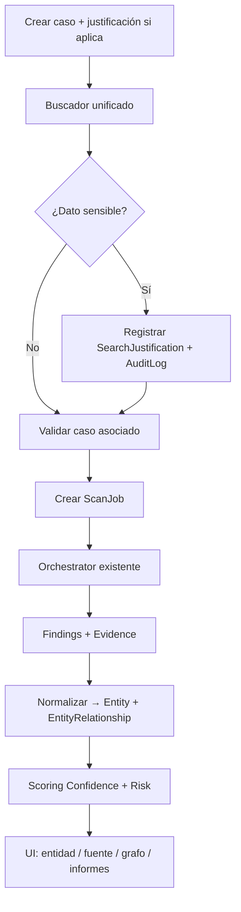
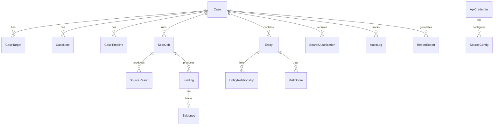

# GLOBEYE — Plan de evolución a plataforma OSINT por casos

> **Documento:** auditoría funcional, técnica y de producto + roadmap de implementación.
> **Fecha:** 2026-05-21
> **Rama auditada:** `main` (commit `1555a70`). La rama `kike` **no existe** en el remoto/local; este plan aplica al código actual del workspace. Si `kike` es una rama de trabajo futura, revalidar diff antes de Fase 1.
> **Restricción explícita:** sin login, usuarios, roles ni permisos multiusuario en las fases 0–4.

---

## Tabla de contenidos

1. [Estado actual del proyecto](#1-estado-actual-del-proyecto)
2. [Visión de producto](#2-visión-de-producto)
3. [Mapa funcional de la aplicación](#3-mapa-funcional-de-la-aplicación)
4. [Módulos nuevos propuestos](#4-módulos-nuevos-propuestos)
5. [Fuentes/API recomendadas](#5-fuentesapi-recomendadas)
6. [Modelo de datos propuesto](#6-modelo-de-datos-propuesto)
7. [Endpoints FastAPI propuestos](#7-endpoints-fastapi-propuestos)
8. [Propuesta de frontend](#8-propuesta-de-frontend)
9. [Roadmap por fases](#9-roadmap-por-fases)
10. [Archivos a modificar y crear](#10-archivos-a-modificar-y-crear)
11. [Riesgos técnicos y legales](#11-riesgos-técnicos-y-legales)
12. [Recomendaciones de prioridad](#12-recomendaciones-de-prioridad)
13. [Nota futura: login y multiusuario](#13-nota-futura-login-y-multiusuario)
14. [Tabla estado actual vs objetivo](#14-tabla-estado-actual-vs-objetivo)

---

## 1. Estado actual del proyecto

### 1.1 Resumen ejecutivo

GLOBEYE v0.1.0 es un **toolkit OSINT pasivo maduro a nivel de motor**: detección de objetivos, orquestación concurrente, 13 fuentes registradas, pivoting, enriquecimiento offline, informes JSON/HTML interactivos, CLI Typer+Rich, API FastAPI y UI React. Lo que **aún no es** una plataforma de investigación: no hay casos, entidades persistentes, grafo de investigación, jobs asíncronos, scoring formal, auditoría de búsquedas sensibles ni módulos de documentos/teléfono/persona.

### 1.2 Módulos y carpetas

| Ruta | Responsabilidad |
|------|-----------------|
| `src/globeye/core/` | Modelos Pydantic (`Target`, `Finding`, `Evidence`, `ScanResult`), detección de target (`target.py`), orquestador async (`orchestrator.py`), pivot (`pivot.py`), contexto de scan (`context.py`), persistencia mínima (`db.py` → `ScanRecord`) |
| `src/globeye/sources/` | ABC `PassiveSource`, registro auto-descubierto (`discover_sources`), catálogo humano (`catalog.py`). Subpaquetes: `infra/`, `identity/`, `code/`, `social/` |
| `src/globeye/enrichment/` | GeoIP/ASN offline (`geoip.py`, `asn.py`), etiquetado de reputación heurístico (`reputation.py`) — sin red |
| `src/globeye/report/` | Export JSON (`json_writer.py`), HTML standalone con grafo/timeline (`html_writer.py`, `graph.py`, plantilla Jinja) |
| `src/globeye/api/` | FastAPI factory (`main.py`), auth por `X-API-Key` de despliegue (`auth.py`), rutas `health`, `scan`, `history` |
| `src/globeye/cli/` | Typer: `scan`, `sources` (health), export JSON/HTML |
| `src/globeye/utils/` | Cliente HTTP con guardia pasiva (`http.py`), caché disco TTL, rate limit async, redacción de secretos, logging structlog |
| `frontend/` | SPA React+TS+Vite+Tailwind, i18n ES/EN, Cytoscape para grafo por scan |
| `tests/` | ~73 tests: unit (sources, orchestrator, target, http guard, cache, report), integration (API, CLI), e2e (scan completo con fixtures) |
| `docs/` | Arquitectura, fuentes, uso, legal, informe de muestra |

### 1.3 Funcionalidades implementadas

| Área | Estado |
|------|--------|
| Detección automática de target | ✅ Regex + validación (dominio, IP, ASN, CIDR, cert hash, email, username, teléfono, persona, org) |
| Orquestación pasiva concurrente | ✅ `asyncio.gather` + semáforo por fuente |
| Pivoting | ✅ Profundidad 1 por defecto; emails/usernames desde findings |
| 13 fuentes OSINT | ✅ Ver §1.4 |
| Guardia “nunca tocar el target” | ✅ Allowlist por fuente + tests de URLs salientes |
| Caché y rate limits | ✅ Disco TTL + `AsyncRateLimiter` |
| Proxy/Tor | ✅ `GLOBEYE_PROXY_URL` en httpx |
| Redacción de secretos en logs | ✅ `Redactor` + `SecretStr` en settings |
| Informes | ✅ JSON + HTML interactivo (filtros, grafo, timeline, print-PDF) |
| Historial | ✅ `ScanRecord` en SQLite (JSON completo del scan) |
| API REST mínima | ✅ `POST /api/scan`, historial, informe HTML, health, sources |
| CLI | ✅ `globeye scan`, `globeye sources` |
| UI web | ✅ Formulario scan + tabla findings + grafo + historial plano |
| Enriquecimiento | ✅ GeoIP opcional (MaxMind), reputación heurística |
| CI/calidad | ✅ Ruff, mypy strict, Bandit, CodeQL, cobertura ≥85% |

### 1.4 Fuentes OSINT actuales (13)

| Nombre | Categoría | Targets soportados | API key |
|--------|-----------|-------------------|---------|
| `rdap` | Infra | domain, IP, ASN | No |
| `crtsh` | Infra | domain | No |
| `shodan` | Infra | IP, domain | Sí |
| `censys` | Infra | IP, domain | Sí |
| `securitytrails` | Infra | domain | Sí |
| `otx` | Infra | domain, IP | Opcional |
| `wayback` | Infra | domain | No |
| `hibp` | Identidad | email | Sí |
| `hunter` | Identidad | domain | Sí |
| `dehashed` | Identidad | email, username | Sí |
| `gravatar` | Identidad | email | No |
| `github` | Código | domain, email, org | Sí (token) |
| `pastebin` | Código | domain, email | Sí (Google CSE) |
| `username_enum` | Social | username | No |

**Nota:** `person` y `phone` se detectan como targets pero **no tienen fuentes dedicadas**; las fuentes aplicables son las que coinciden por tipo (p. ej. ninguna específica para `person` hoy).

### 1.5 Tipos de input soportados

| Tipo | Detección | Fuentes que suelen aplicar |
|------|-----------|----------------------------|
| `domain` | tldextract offline | crtsh, rdap, shodan, censys, securitytrails, otx, wayback, hunter, github, pastebin |
| `ip` | ipaddress | rdap, shodan, censys, otx |
| `asn` | regex ASn | rdap |
| `cidr` | ip_network | Limitado (pocas fuentes) |
| `cert_hash` | hex 40/64 | censys (si implementado para hash) |
| `email` | regex | hibp, dehashed, gravatar, github, pastebin |
| `username` | regex | dehashed, username_enum |
| `phone` | dígitos E.164-like | **Ninguna dedicada** |
| `person` | tokens nombre | **Ninguna dedicada** (cae en org genérico si no match) |
| `org` | fallback texto libre | github (parcial) |

**No soportados aún como tipos first-class:** `url`, `document`, `certificate` (como entidad), `breach`, `finding` como entidad persistida.

### 1.6 Limitaciones del estado actual

1. **Modelo de datos plano:** un scan = un blob JSON; sin entidades, relaciones ni casos.
2. **Sin jobs:** el API ejecuta el scan en la petición HTTP (timeout en scans largos/profundos).
3. **Sin profundidad configurable** en API/UI (solo `pivot` boolean; CLI sin selector rápido/estándar/profundo).
4. **Sin scoring numérico** de riesgo/confianza (solo enum `Confidence` por finding).
5. **Sin evidencias persistidas** separadas del finding ( `raw_evidence` va embebido en JSON del scan).
6. **Sin auditoría de búsquedas sensibles** ni justificación obligatoria.
7. **Sin gestión de API keys en UI** (solo `.env` / variables de entorno).
8. **Frontend monolítico:** una sola vista, sin router, sin casos.
9. **Auth actual:** `X-API-Key` de **despliegue** (protege el servidor), no identidad de investigador — distinto del login multiusuario que se pospone.
10. **Persona/teléfono/documentos:** detectados o no modelados; sin módulos de producto.
11. **Grafo:** derivado en cliente por scan; no grafo transversal ni preparado para Neo4j.
12. **SQLite + JSON:** escala limitada; sin índices de grafo ni búsqueda full-text.

### 1.7 Preparado para escalar vs no preparado

| Preparado ✅ | No preparado ❌ |
|-------------|----------------|
| Registro de fuentes plug-in (`@register`) | Modelo relacional de investigación |
| Contrato `Finding` / `Evidence` estable | Normalización de entidades entre scans |
| Guardia HTTP y tests de pasividad | Cola de trabajos / workers |
| Settings centralizados (`pydantic-settings`) | Credenciales en BD cifradas |
| Factory FastAPI (sin side effects en import) | OpenSearch / Neo4j |
| Separación core / sources / api / cli | Multi-tenant / RBAC |
| Informes desacoplados (`report/`) | Diff entre scans temporales |
| i18n frontend (ES/EN) | Routing y estado global de app |

### 1.8 Impacto en migraciones futuras

| Tecnología | Compatibilidad actual | Riesgo / trabajo |
|------------|----------------------|------------------|
| **PostgreSQL** | SQLModel + URL configurable (`GLOBEYE_DB_URL`) | Bajo si se diseñan FKs y tipos portables; migrar JSON blobs a tablas normalizadas |
| **OpenSearch** | No hay índice | Medio: indexar findings/entidades desde workers post-scan |
| **Neo4j** | Solo `GraphNodeHint` en memoria | Medio: exportar nodos/aristas desde `EntityRelationship`; no acoplar UI a Neo4j en MVP |
| **Multiusuario** | Sin `user_id` en tablas | Alto si no se reserva `owner_id` nullable + `created_by` desde Fase 1 |

**Recomendación:** desde Fase 1 añadir columnas opcionales `created_by: str | None = None` (nombre libre o máquina) y `case_id` en scans — **sin tabla User** — para no romper migración futura.

---

## 2. Visión de producto

Transformar GLOBEYE en una **herramienta interna/local de investigación OSINT pasiva**, organizada por **casos**, manteniendo el motor existente y la política de no contactar el target.

### Principios

- **Pasivo y auditable:** cada consulta a terceros con timestamp, hash de evidencia y fuente.
- **Por casos:** ningún scan “suelto”; todo investigación vive en un caso con contexto y notas.
- **Útil en práctica:** dashboard, buscador único, fichas de entidad, informes exportables.
- **Legal-by-design:** justificación obligatoria para persona, teléfono, DNI/NIF y datos sensibles; no almacenar contraseñas de breaches.
- **Sin multiusuario ahora:** una instancia = un equipo confiable; arquitectura lista para auth después.

### Capacidades objetivo (MVP → completo)

| Capacidad | MVP (F1–2) | Completo (F3–5) |
|-----------|------------|-----------------|
| Dashboard | Resumen casos, jobs, errores | Consumo APIs, riesgos destacados |
| Casos | CRUD, targets, notas, timeline | Archivo, justificación, exports |
| Buscador unificado | Detección + profundidad + caso obligatorio | Estimación coste/tiempo, selector fuentes |
| Vista entidad | Ficha básica + findings agregados | Historial, tags, merge duplicados |
| Resultados por fuente | Agrupación por scan | Estado fuente, raw/normalizado |
| Grafo | Cytoscape por caso (datos API) | Preparado export Neo4j |
| Documentos públicos | — | Búsqueda + metadatos + evidencias |
| Teléfono / persona / org | Justificación + audit log | Proveedores opcionales + perfiles |
| Informes | JSON, HTML | + PDF, CSV, plantillas ejecutivas |
| Configuración | API keys en UI (local) | Proxy, retención, borrado seguro |
| Scoring | Confianza existente + severidad finding | Risk score numérico por entidad |

---

## 3. Mapa funcional de la aplicación

### 3.1 Navegación global (árbol)

```text
/ (redirect → /dashboard)

/dashboard                          [A] Dashboard general

/cases                              [B] Listado de casos
/cases/new                          [B] Crear caso
/cases/:caseId                      [B] Detalle caso (tabs)
  ├─ overview                       timeline, resumen, notas
  ├─ /cases/:caseId/search          [C] Buscador unificado
  ├─ /cases/:caseId/entities        listado entidades
  ├─ /cases/:caseId/entities/:id    [D] Ficha entidad
  ├─ /cases/:caseId/findings        hallazgos filtrables
  ├─ /cases/:caseId/evidence        [F] Evidencias
  ├─ /cases/:caseId/sources         [E] Resultados por fuente
  ├─ /cases/:caseId/graph           [G] Grafo relaciones
  ├─ /cases/:caseId/documents       [H] Documentos públicos (F3)
  ├─ /cases/:caseId/phone           [I] Teléfonos del caso (F4)
  ├─ /cases/:caseId/people          [J] Personas/org (F4)
  ├─ /cases/:caseId/reports         [K] Informes
  └─ /cases/:caseId/audit           actividad del caso

/sources                            catálogo global fuentes (estado)

/settings
  ├─ /settings/api-keys             [K] Credenciales
  ├─ /settings/sources              activar/desactivar fuentes
  ├─ /settings/proxy                Tor/SOCKS5
  ├─ /settings/audit                auditoría local
  ├─ /settings/legal                políticas, retención sensibles
  └─ /settings/retention            retención y borrado

NO: /login, /register, /users, /roles, /permissions
```

### 3.2 Wireframe lógico por sección

#### A. Dashboard

| Widget | Datos |
|--------|-------|
| Tarjetas casos activos/archivados | `Case.status` count |
| Últimas investigaciones | últimos `ScanJob` |
| Entidades descubiertas (7d) | `Entity` count |
| Alertas críticas | findings `reputation=sensitive` + risk alto |
| Fuentes activas/inactivas | `SourceConfig` + health |
| Consumo APIs | contador por fuente (AuditLog / métricas) |
| Jobs en ejecución | `ScanJob.status=running` |
| Errores recientes | `SourceResult.error` últimos N |
| Riesgos destacados | top `RiskScore` |

#### B. Casos / Investigations

- Crear: título, descripción, referencia interna, etiquetas, **justificación del caso** (si sensibilidad alta).
- Listar: filtros estado, fecha, tags.
- Detalle: tabs (overview, search, entities, graph, reports, audit).
- Timeline: eventos (`CaseTimeline`: scan iniciado, entidad nueva, nota, export).
- Asociar targets: `CaseTarget` (valor + tipo detectado).
- Notas internas: `CaseNote` (markdown ligero).

#### C. Buscador unificado

```
┌─────────────────────────────────────────────────────────┐
│ Caso: [Investigación ACME ▼]  (obligatorio)             │
│ ┌─────────────────────────────────────────────────────┐ │
│ │ Buscar: user@example.com                            │ │
│ └─────────────────────────────────────────────────────┘ │
│ Detectado: EMAIL · Confianza detección: alta            │
│ Profundidad: (•) Rápido  ( ) Estándar  ( ) Profundo     │
│ Fuentes: [x] todas  [ ] seleccionar...                  │
│ Estimación: ~12 fuentes · ~45s · coste API: bajo        │
│ [ Si sensibilidad: Justificación: ____________ ]        │
│                              [ Ejecutar investigación ] │
└─────────────────────────────────────────────────────────┘
```

**Reglas sensibles:** `person`, `phone`, y patrones DNI/NIF → modal de justificación → `SearchJustification` + `AuditLog` antes de ejecutar.

#### D. Vista de entidad

Ficha con: tipo, valor normalizado, risk/confidence scores, fuentes, first/last seen, relaciones, evidencias, historial (`EntityHistory`), notas.

#### E. Resultados por fuente

Tabla por fuente: estado, latencia, error, tabs Raw | Normalizado | Evidencias | Confianza.

#### F. Grafo

Cytoscape (MVP) con layout por tipo de arista; leyenda; filtro por tipo relación. Modelo API: nodos `Entity`, aristas `EntityRelationship` con `relationship_type` enum.

#### G. Documentos públicos (F3)

Búsqueda por dominio/org → lista documentos → panel metadatos (autor, software, rutas internas) → vincular a entidades.

#### H. Teléfono (F4)

Validación E.164, país, tipo línea (si API), historial de consultas auditado, aviso legal prominente.

#### I. Persona / organización (F4)

Perfil agregado de menciones públicas; justificación obligatoria; sin agregación de datos no públicos.

#### J. Informes

Generador por plantilla; preview HTML; descarga JSON/CSV/HTML/PDF.

#### K. Configuración

API keys cifradas en reposo (ver §6); toggles de fuentes; proxy; retención; vista de audit log local.

### 3.3 Diagrama de flujo de investigación



---

## 4. Módulos nuevos propuestos

Estructura bajo `src/globeye/` (nombres alineados con convención actual):

### A. `cases/` — Módulo de casos

| Componente | Responsabilidad |
|------------|-----------------|
| `Case` | Investigación: título, estado, fechas, sensibilidad |
| `CaseTarget` | Objetivos iniciales del caso |
| `CaseNote` | Notas internas |
| `CaseTimeline` | Eventos auditables del caso |
| `CaseExport` | Registro de informes generados |

### B. `entities/` — Entidades

| Componente | Responsabilidad |
|------------|-----------------|
| `Entity` | Nodo normalizado (tipo + valor único por caso o global) |
| `EntityRelationship` | Arista tipada (domain→ip, email→domain, …) |
| `EntityTag` | Etiquetas libres |
| `EntityHistory` | Cambios de atributos/score |

### C. `evidence/` — Evidencias

| Componente | Responsabilidad |
|------------|-----------------|
| `Evidence` | Registro auditable (enlaza finding/source) |
| `EvidenceFile` | Artefacto en disco (HTML snapshot, PDF) |
| `EvidenceRawResponse` | JSON crudo (o referencia blob) |
| `EvidenceHash` | SHA-256 + algoritmo |

### D. `scoring/` — Scoring

| Componente | Responsabilidad |
|------------|-----------------|
| `ConfidenceScore` | 0–100 derivado de `Confidence` + fiabilidad fuente |
| `RiskScore` | 0–100 por entidad (breaches, pastes, exposición) |
| `SourceReliability` | Peso por fuente (configurable) |
| `FindingSeverity` | info / notable / sensitive / critical |

### E. `documents/` — Documentos públicos (F3)

`DocumentSearch`, `DocumentMetadataExtractor`, `DocumentEntityExtractor`, `PublicDocumentFinding`.

### F. `phone/` — Teléfono (F4)

`PhoneValidator` (E.164), `PhoneProviderAdapter` (Twilio, Numverify, …), `PhoneFinding`.

### G. `profiles/` — Persona/organización (F4)

`PersonProfile`, `OrganizationProfile`, `PublicMention`, `CorporateRelation`.

### H. `compliance/` — Auditoría/legal local

`AuditLog`, `SearchJustification`, `SensitiveSearchControl`, `DataRetentionPolicy`.

### I. `jobs/` — Jobs

`JobQueue` (abstracción), `ScanJob`, `JobStatus`, `JobResult`, `RetryPolicy`. Fase 1: tabla + estados; Fase 5: Redis/Celery.

### J. `reports/` — Informes (ampliar `report/` existente)

`ReportTemplate`, `ReportExport`, `ReportSection`, `ExecutiveSummary` — convivir con `html_writer`/`json_writer`.

### K. `settings_store/` — Configuración persistente

`ApiCredential`, `SourceConfig`, `RateLimitConfig`, `ProxyConfig` — complementa `.env` para UI local.

### Futuro (solo notas en código, NO implementar)

```python
# FUTURE: auth/models/user.py — User, Role, Permission, Session
# FUTURE: case.owner_id FK → users.id
# FUTURE: audit_log.actor_id → users.id
```

---

## 5. Fuentes/API recomendadas

### 5.1 Ya integradas (mantener)

RDAP, crt.sh, Shodan, Censys, SecurityTrails, OTX, Wayback, HIBP, Hunter, DeHashed, Gravatar, GitHub, Pastebin (CSE), username_enum.

### 5.2 Prioridad de nuevas integraciones

#### P0 — Alto valor, encaje pasivo, esfuerzo moderado

| Fuente | Categoría | Motivo |
|--------|-----------|--------|
| **VirusTotal** | Infra | Passive DNS, relaciones dominio/IP (API v3) |
| **AbuseIPDB** | Infra | Reputación IP (solo consulta) |
| **URLScan.io** | Infra | URLs históricas indexadas (no scan live al target) |
| **EmailRep** | Email | Reputación email pasiva |
| **Common Crawl / Internet Archive** | Documentos | Ampliar Wayback; índice de documentos |
| **Google/Bing/Brave Search API** | Documentos | `filetype:pdf` por dominio (ya hay patrón CSE) |

#### P1 — Medio plazo

| Fuente | Categoría | Motivo |
|--------|-----------|--------|
| **GreyNoise** | Infra | Contexto IP benigno/malicioso (API community) |
| **DNSDB (Farsight)** | Infra | Passive DNS premium |
| **OpenCorporates** | Empresas | Organizaciones / dominios corporativos |
| **Intelligence X** | Leaks | Con controles estrictos; sin passwords |
| **LeakCheck** | Leaks | Solo si ToS y legal OK; metadata only |
| **Twilio Lookup / Numverify** | Teléfono | Validación legal con justificación |

#### P2 — Opcional / cuidado legal y activo

| Fuente | Nota |
|--------|------|
| Subfinder/Amass | Solo si se limita a fuentes pasivas (CT, DNS pasivo); no brute force |
| ZoomEye, BGP/PeeringDB | Infra adicional |
| Registros BOE / mercantiles | Por jurisdicción; scraping con cautela |
| Extractores metadatos (exif, pdf) | Local post-descarga; no enviar a target |

### 5.3 Leaks/breaches — política

- Almacenar: nombre breach, fecha, dominio afectado, **no** contraseñas ni hashes de contraseña.
- DeHashed/HIBP: mantener redacción actual; extender tests.
- UI: banner legal + justificación + audit log.

---

## 6. Modelo de datos propuesto

SQLModel, compatible SQLite → PostgreSQL. Convenciones:

- PK: `id: int | None` autoincrement (o UUID en PG opcional).
- Timestamps: `created_at`, `updated_at` UTC.
- **Futuro multiusuario:** `owner_id: str | None = None` (nullable, sin FK aún), `tenant_id: str | None = None`.

### 6.1 Diagrama ER simplificado



### 6.2 Tablas (campos principales)

#### `Case`

| Campo | Tipo | Notas |
|-------|------|-------|
| id | int PK | |
| title | str | index |
| description | str \| None | |
| status | enum | open, archived, closed |
| sensitivity | enum | normal, elevated, restricted |
| justification | str \| None | caso sensible |
| reference_code | str \| None | índice único opcional |
| owner_id | str \| None | **FUTURE user** |
| created_at, updated_at | datetime | index created_at |

Índices: `(status, created_at)`, `(reference_code)` unique sparse.

#### `CaseTarget`

| Campo | Tipo |
|-------|------|
| id, case_id FK | |
| raw_input | str |
| target_type | str |
| normalized_value | str |
| is_primary | bool |

Índice: `(case_id, normalized_value, target_type)` unique.

#### `CaseNote` / `CaseTimeline` / `CaseExport`

- Note: `case_id`, `body`, `created_at`
- Timeline: `case_id`, `event_type`, `payload_json`, `created_at`
- Export: `case_id`, `report_export_id`, `created_at`

#### `Entity`

| Campo | Tipo |
|-------|------|
| id, case_id FK | |
| entity_type | enum (domain, ip, …) |
| normalized_value | str |
| display_value | str |
| first_seen_at, last_seen_at | datetime |
| confidence_score | float \| None |
| risk_score | float \| None |
| metadata_json | str |

Índice único: `(case_id, entity_type, normalized_value)`.

#### `EntityRelationship`

| case_id, source_entity_id, target_entity_id, relationship_type, source_name, first_seen_at |

Índice: `(case_id, source_entity_id)`, `(case_id, target_entity_id)`.

#### `Finding`

| scan_job_id, case_id, entity_id nullable, source, kind, value, confidence, normalized_data_json, severity |

#### `Evidence`

| finding_id, source_url, retrieved_at, content_hash, storage_path, raw_json (o path) |

**Cifrado en reposo:** `ApiCredential.secret_encrypted`, opcionalmente `EvidenceRawResponse` si contiene PII.

**Sensibles:** emails, teléfonos, person names, breach metadata, raw JSON.

#### `SourceResult`

| scan_job_id, source_name, status, latency_ms, error, findings_count, started_at, finished_at |

#### `ScanJob`

| case_id, target snapshot, pivot, depth, status, progress, result_summary_json, error, started_at, finished_at |

#### `AuditLog`

| case_id nullable, action, resource_type, resource_id, details_json, ip_client nullable, created_at |

#### `SearchJustification`

| case_id, scan_job_id nullable, target_type, target_value, reason_text, approved_at |

#### `ApiCredential`

| provider, key_name, secret_encrypted, last_verified_at, is_active |

#### `SourceConfig`

| source_name, enabled, rate_override_json |

#### `ReportExport`

| case_id, template, format, file_path, checksum, created_at |

#### `Tag` + `EntityTag` (many-to-many)

#### `Note` (entidad)

`entity_id`, `body`, `created_at`

### 6.3 Compatibilidad SQLite ↔ PostgreSQL

- Evitar tipos SQLite-only; usar `JSON` como `TEXT` + serialización o `sa.JSON`.
- FKs con `ondelete` explícito.
- Migraciones: Alembic (introducir en Fase 1).
- Mantener `ScanRecord` legacy durante transición (vista o migración one-shot).

### 6.4 Preparación multiusuario (sin implementar)

- Reservar `owner_id`, `tenant_id` nullable en `Case`, `AuditLog`, `ScanJob`.
- No crear tablas `User` hasta fase futura.
- Separar `GLOBEYE_API_KEY` (despliegue) de identidad humana (futuro JWT/session).

---

## 7. Endpoints FastAPI propuestos

Prefijo: `/api`. Auth de despliegue: mantener `X-API-Key` opcional/debug (no es login de usuario). Rutas nuevas sin auth de usuario.

### 7.1 Casos

| Método | Ruta | Descripción |
|--------|------|-------------|
| POST | `/api/cases` | Crear caso |
| GET | `/api/cases` | Listar (filtros: status, q, limit, offset) |
| GET | `/api/cases/{case_id}` | Detalle |
| PATCH | `/api/cases/{case_id}` | Actualizar |
| POST | `/api/cases/{case_id}/archive` | Archivar |
| DELETE | `/api/cases/{case_id}` | Borrado lógico/físico (según política) |
| GET | `/api/cases/{case_id}/timeline` | Timeline |
| POST | `/api/cases/{case_id}/notes` | Añadir nota |
| GET | `/api/cases/{case_id}/targets` | Targets |
| POST | `/api/cases/{case_id}/targets` | Añadir target |

### 7.2 Scans / Jobs

| Método | Ruta | Descripción |
|--------|------|-------------|
| POST | `/api/cases/{case_id}/scans` | Lanzar scan (body: target, pivot, depth, sources[]) |
| GET | `/api/jobs/{job_id}` | Estado job |
| POST | `/api/jobs/{job_id}/cancel` | Cancelar |
| POST | `/api/jobs/{job_id}/retry` | Relanzar |
| GET | `/api/jobs/{job_id}/results` | Resultados normalizados |
| GET | `/api/cases/{case_id}/jobs` | Jobs del caso |

**Compatibilidad:** mantener `POST /api/scan` deprecado → crea caso default o exige `case_id` en query (Fase 1).

### 7.3 Entidades

| GET | `/api/cases/{case_id}/entities` | Listar |
| GET | `/api/entities/{entity_id}` | Ficha |
| GET | `/api/entities/{entity_id}/relationships` | Relaciones |
| POST | `/api/entities/{entity_id}/notes` | Nota |
| POST | `/api/entities/{entity_id}/tags` | Tag |
| POST | `/api/entities/merge` | Fusionar duplicados |

### 7.4 Fuentes

| GET | `/api/sources` | (existente) Catálogo |
| PATCH | `/api/sources/{name}` | Activar/desactivar |
| POST | `/api/sources/{name}/verify` | Probar credenciales |
| GET | `/api/sources/{name}/status` | Salud |

### 7.5 Evidencias

| GET | `/api/cases/{case_id}/evidence` | Listar |
| GET | `/api/evidence/{id}` | Detalle |
| GET | `/api/evidence/{id}/download` | Descarga |
| GET | `/api/evidence/{id}/raw` | JSON crudo |
| GET | `/api/evidence/{id}/hash` | SHA-256 |

### 7.6 Informes

| POST | `/api/cases/{case_id}/reports` | Generar |
| GET | `/api/cases/{case_id}/reports` | Listar |
| GET | `/api/reports/{id}` | Metadatos |
| GET | `/api/reports/{id}/download` | JSON/CSV/HTML/PDF |

### 7.7 Configuración y compliance

| GET/POST | `/api/settings/api-keys` | CRUD credenciales |
| GET/PATCH | `/api/settings/sources` | Config fuentes |
| GET/PATCH | `/api/settings/proxy` | Proxy/Tor |
| GET/PATCH | `/api/settings/rate-limits` | Límites |
| GET | `/api/settings/audit` | Audit log (paginado) |
| GET/PATCH | `/api/settings/retention` | Retención |
| POST | `/api/settings/purge` | Borrado seguro |

### 7.8 Sensibilidad

| POST | `/api/justifications` | Registrar justificación pre-scan |
| GET | `/api/cases/{case_id}/justifications` | Historial |

### 7.9 NO incluir

`/api/login`, `/api/logout`, `/api/register`, `/api/users`, `/api/roles`, `/api/permissions`, `/api/sessions`.

---

## 8. Propuesta de frontend

### 8.1 Estado actual

- **Sin React Router:** todo en `App.tsx`.
- Componentes: `Header`, `ScanForm`, `FindingsTable`, `RelationshipGraph`, `HistoryPanel`, `SourcesPanel`.
- API: `api.ts` — scan, history, sources, report.
- Tema dark/light, i18n ES/EN, API key en localStorage.

### 8.2 Transformación propuesta

| Aspecto | Decisión |
|---------|----------|
| Routing | `react-router-dom` v6 |
| Estado servidor | TanStack Query (cache, refetch jobs) |
| Layout | `AppShell`: sidebar fija + header + outlet |
| UI | Mantener Tailwind; componentes `ui/` reutilizables (Card, Table, Badge, Tabs) |
| Grafo | Extraer `RelationshipGraph` → `EntityGraph` con datos de caso |
| Formularios | React Hook Form + Zod |

### 8.3 Mapa de rutas (implementación)

Ver §3.1 — rutas exactas solicitadas.

### 8.4 Componentes principales

| Componente | Uso |
|------------|-----|
| `AppShell` | Layout sidebar + main |
| `SidebarNav` | Navegación dashboard/casos/settings |
| `DashboardCards` | Métricas §3.2.A |
| `CaseList` / `CaseForm` | CRUD casos |
| `CaseDetailTabs` | Router anidado por caso |
| `UnifiedSearch` | Buscador §3.2.C |
| `SensitivityModal` | Justificación |
| `EntityDetail` | Ficha §3.2.D |
| `SourceResultsPanel` | §3.2.E |
| `EntityGraph` | Cytoscape §3.2.F |
| `EvidenceList` / `EvidenceViewer` | Raw + hash |
| `ReportsPanel` | Generación y descarga |
| `SettingsApiKeys` | Gestión claves |
| `AuditLogTable` | Compliance |

### 8.5 Sidebar (estructura)

```text
GLOBEYE
─────────────
Dashboard
Casos
Fuentes
─────────────
Configuración ▸
  API Keys
  Fuentes
  Proxy
  Auditoría
  Legal
  Retención
─────────────
[v0.x]  [ES|EN]  [theme]
```

### 8.6 Compatibilidad

- Mantener ruta `/` servida por FastAPI con SPA fallback (`index.html` para rutas cliente).
- Vite: `historyApiFallback` en dev; build copia a `api/static/`.

---

## 9. Roadmap por fases

### Fase 0 — Auditoría y base (actual)

| Tarea | Entregable |
|-------|------------|
| Auditoría repo | Este `PLAN.md` |
| Validar tests CI | `make test` en entorno limpio |
| Inventario deuda | JSON blobs, scan síncrono, sin entidades |
| Congelar contratos | `Finding`, `ScanResult` estables |

### Fase 1 — Casos y entidades (MVP núcleo)

- Modelos SQLModel: `Case`, `CaseTarget`, `Entity`, `EntityRelationship`, `ScanJob`.
- `POST /api/cases/{id}/scans` + worker ligero (BackgroundTasks → cola real en F5).
- Migración: scan legacy → asociado a `default` case opcional.
- Frontend: router + listado/detalle caso + buscador con caso obligatorio.
- CLI: flag `--case-id` o `--case-title` para asociar.
- **Sin login.**

### Fase 2 — Dashboard, evidencias, informes, auditoría

- Dashboard widgets.
- Persistencia `Evidence`, `SourceResult`.
- Informes JSON/HTML por caso (reutilizar writers).
- `AuditLog`, `SearchJustification` básico.
- Vista entidad y resultados por fuente.

### Fase 3 — Documentos, grafo, scoring

- Módulo `documents/` + UI.
- `RiskScore`, `ConfidenceScore` formal.
- Grafo por caso desde API (no solo cliente).
- Metadatos extractores.

### Fase 4 — Teléfono, persona, org, legal avanzado, PDF

- `phone/`, `profiles/` + controles sensibilidad.
- Informes PDF (weasyprint o playwright).
- Políticas retención y purge UI.

### Fase 5 — Escala

- PostgreSQL + Alembic.
- Redis + Celery/RQ para jobs.
- OpenSearch indexación.
- Neo4j export opcional.

### Fase futura — Multiusuario / SaaS

- User, Role, Permission, Session, JWT/OAuth.
- `owner_id` FK, tenants, RBAC por caso.
- Separar API key de despliegue vs identidad.

---

## 10. Archivos a modificar y crear

### 10.1 Modificar (existentes)

| Archivo | Cambio previsto |
|---------|-----------------|
| `src/globeye/core/db.py` | Ampliar modelos o importar desde `db/models/` |
| `src/globeye/core/models.py` | Tipos entidad/relación si se comparten con API |
| `src/globeye/core/orchestrator.py` | Aceptar `ScanJob` context, persistir entidades post-scan |
| `src/globeye/core/target.py` | URL, document, DNI/NIF patterns; sensibilidad flag |
| `src/globeye/api/main.py` | Registrar nuevos routers |
| `src/globeye/api/routes/scan.py` | Deprecar/enlazar a case scans |
| `src/globeye/config.py` | Settings DB encryption key, retention |
| `src/globeye/cli/app.py` | Flags `--case` |
| `frontend/src/App.tsx` | Reemplazar por router shell |
| `frontend/src/api.ts` | Cliente casos, jobs, entidades |
| `frontend/package.json` | react-router-dom, tanstack-query |
| `docs/architecture.md` | Actualizar diagrama |
| `tests/integration/test_api.py` | Nuevos endpoints |
| `pyproject.toml` | deps: alembic, cryptography (Fase 1–2) |

### 10.2 Crear (nuevos)

```text
PLAN.md                                    (este documento)
src/globeye/db/
  __init__.py
  models/
    case.py
    entity.py
    evidence.py
    job.py
    compliance.py
    settings.py
  repositories/
    case_repo.py
    entity_repo.py
    job_repo.py
  migrations/                              (Alembic)
src/globeye/services/
  scan_service.py                            (orquesta job + persist)
  entity_normalizer.py
  scoring_service.py
src/globeye/api/routes/
  cases.py
  entities.py
  jobs.py
  evidence.py
  reports.py
  settings.py
  justifications.py
src/globeye/cases/                         (lógica dominio, opcional)
src/globeye/compliance/
src/globeye/jobs/
frontend/src/
  routes/
    Dashboard.tsx
    cases/CaseList.tsx
    cases/CaseDetail.tsx
    cases/UnifiedSearch.tsx
    entities/EntityDetail.tsx
    graph/EntityGraph.tsx
    settings/...
  layouts/AppShell.tsx
  hooks/useCases.ts
```

---

## 11. Riesgos técnicos y legales

### 11.1 Técnicos

| Riesgo | Mitigación |
|--------|------------|
| Timeout API en scans profundos | Jobs async Fase 1+ |
| Duplicación entidades | Normalización + merge endpoint |
| Migración SQLite → PG | Alembic desde Fase 1 |
| Romper CLI/tests | Mantener `POST /api/scan`; tests de regresión |
| Crecimiento BD (raw JSON) | Externalizar evidencias a disco + hash |
| Cifrado keys en SQLite | `cryptography` + master key en env local |

### 11.2 Legales / cumplimiento

| Riesgo | Mitigación |
|--------|------------|
| GDPR / LECrim — datos personales | Justificación, minimización, retención, purge |
| ToS proveedores | Rate limits + audit; no redistribución masiva |
| Breaches — contraseñas | Nunca persistir; redact tests |
| Teléfono/persona — doxxing | Controles sensibilidad + audit + uso interno |
| Documentos — metadatos PII | Marcado sensibilidad en evidencias |
| Herramienta sin login | Solo red local/VPN; API key fuerte; no exponer a internet |

---

## 12. Recomendaciones de prioridad

1. **Fase 1 casos + ScanJob + entidades** — desbloquea todo el producto.
2. **Buscador con caso obligatorio y justificación sensible** — compliance antes de ampliar fuentes.
3. **Persistir evidencias con hash** — auditabilidad.
4. **No Neo4j hasta Fase 5** — Cytoscape + `EntityRelationship` API basta.
5. **VirusTotal + AbuseIPDB** — primeras fuentes nuevas (P0).
6. **Alembic temprano** — evita dolor de migración.
7. **Mantener guardia pasiva** — todo source nuevo debe tener `allowed_hosts` + test.
8. **Documentar diferencia** API key despliegue vs futuro login en README.

---

## 13. Nota futura: login y multiusuario

Cuando se requiera multiusuario:

1. Añadir `src/globeye/auth/` con JWT o sesiones, tablas `User`, `Role`, `Permission`.
2. Activar FK `owner_id` en `Case`, `ScanJob`, `AuditLog`.
3. Middleware FastAPI: autenticación por ruta; autorización por caso (`CasePermission`).
4. Separar `GLOBEYE_API_KEY` (service-to-service) de tokens de usuario.
5. Frontend: rutas `/login`, guard de rutas, contexto usuario — **no añadir hasta fase futura**.
6. Tenants: columna `tenant_id` ya reservada; filtrar queries por tenant.

**Hasta entonces:** instancia local, red restringida, API key opcional, audit log con `actor_label: str` libre (hostname o analista escrito a mano).

---

## 14. Tabla estado actual vs estado objetivo

| Capacidad | Actual (v0.1) | Objetivo |
|-----------|---------------|----------|
| Organización por casos | ❌ Historial plano | ✅ Casos completos |
| Buscador unificado | ⚠️ Solo target string | ✅ Detección + profundidad + fuentes + caso |
| Vista entidad | ❌ | ✅ Ficha persistente |
| Relaciones / grafo | ⚠️ Por scan en UI | ✅ Por caso + modelo Neo4j-ready |
| Evidencias auditables | ⚠️ Embebidas en finding | ✅ Entidad Evidence + hash |
| Resultados por fuente | ⚠️ Panel en scan | ✅ Vista dedicada + estado |
| Documentos públicos | ❌ | ✅ Fase 3 |
| Teléfono / persona / org | ⚠️ Detección sin módulo | ✅ Fase 4 + justificación |
| Scoring riesgo/confianza | ⚠️ Enum confidence | ✅ Scores numéricos |
| Informes | ✅ JSON/HTML scan | ✅ Por caso + plantillas + PDF |
| Dashboard | ❌ | ✅ Fase 2 |
| API keys en UI | ❌ Solo .env | ✅ Settings local |
| Auditoría / justificación | ❌ | ✅ Fase 2 |
| Jobs async | ❌ Sync | ✅ Fase 1–5 progresivo |
| Login / usuarios | ❌ (correcto) | ⏳ Fase futura |
| Motor OSINT pasivo | ✅ 13 fuentes | ✅ Mantener + ampliar |
| CLI / API / tests | ✅ | ✅ Compatibilidad |

---

## Anexo A — Inventario de tests (referencia)

~73 funciones de test en: `test_smoke`, `test_orchestrator`, `test_target`, `test_http_guard`, `test_api`, `test_cli`, `test_full_scan` (e2e), tests por fuente con fixtures sanitizados.

**Fase 0:** ejecutar `make test` y `make lint` en CI/local y registrar resultado en issue de implementación.

---

## Anexo B — Auth actual (aclaración)

El módulo `src/globeye/api/auth.py` implementa **`X-API-Key` de despliegue** (`GLOBEYE_API_KEY`), no autenticación de usuarios. Es compatible con herramienta interna. En fase futura convivirá con JWT de usuario o se desactivará en favor de sesión.

---

*Fin del plan. Siguiente paso recomendado: revisión humana de este documento → aprobación → inicio Fase 1 sin modificar contratos públicos del CLI.*
