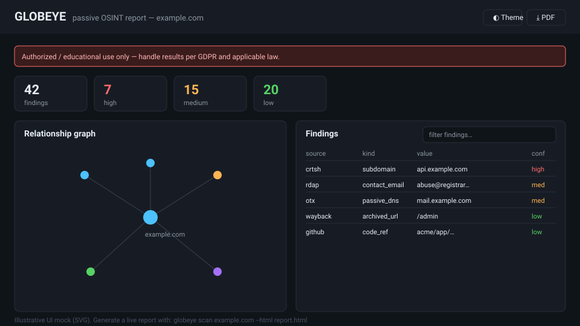
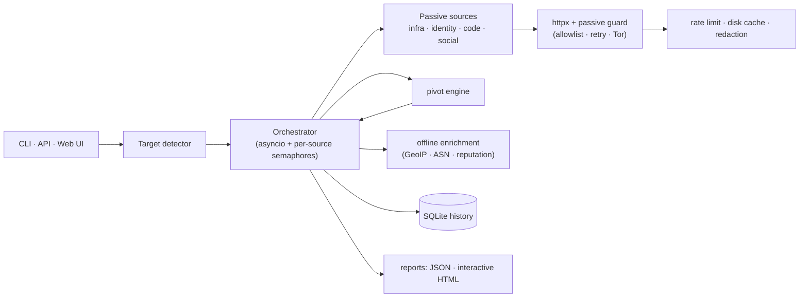

<h1 align="center">🌐 GLOBEYE</h1>

<p align="center">
  <strong>Strictly passive OSINT toolkit</strong> — infrastructure, identity &amp; organizations.<br>
  <em>Never touches the target. Only queries third parties that already indexed the data.</em>
</p>

<p align="center">
  <a href="https://github.com/rauke10/osint/actions/workflows/ci.yml"></a>
  <a href="https://github.com/rauke10/osint/actions/workflows/codeql.yml"></a>
  
  
  
  <a href="https://github.com/astral-sh/ruff"></a>
  
</p>

> ⚠️ **LEGAL DISCLAIMER — READ BEFORE USE**
>
> GLOBEYE is an **educational / authorized-assessment** tool. Use it **only**
> against assets you own or for which you hold **explicit written
> authorization**. Passive collection still processes personal data and is
> regulated (GDPR, LECrim, Budapest Convention, and each provider's Terms of
> Service). **You are solely responsible for how you use this software.** The
> author accepts **no liability** for misuse. See
> [`docs/legal.md`](docs/legal.md) and [`SECURITY.md`](SECURITY.md).

---

<!--
  Demo GIF placeholder — record a short CLI + web-UI capture, save it as
  docs/screenshots/demo.gif, and add it above the static mock below.
-->

<p align="center">
  
  <br><sub>Interactive standalone report — open a real example:
  <a href="docs/sample-report.html"><code>docs/sample-report.html</code></a></sub>
</p>

## Contents

[Why passive](#why-passive) ·
[Features](#features) ·
[Quickstart](#quickstart) ·
[Usage](#usage) ·
[Architecture](#architecture) ·
[Sources](#sources) ·
[Project layout](#project-layout) ·
[Development](#development) ·
[Roadmap](#roadmap) ·
[License](#license)

## Why passive?

Active reconnaissance (port scans, subdomain brute force, direct DNS/HTTP
probing) sends traffic **to the target**: it is noisy, often unauthorized, and
can be unlawful without a contract. **GLOBEYE never contacts the target.** It
only queries third parties that have *already* indexed public information
(Certificate Transparency, RDAP/WHOIS, passive DNS, breach indexes, web
archives, …). This is safer legally and operationally, and leaves no trace on
the target's infrastructure.

> **Provable invariant:** every source is locked to an allowlist of
> third-party hosts by an `httpx` request hook, and the test suite asserts
> that **no request is ever made to the target host** — end to end.

## Features

- **13 passive sources** across infrastructure, identity, code and social,
  with graceful skip when an API key is absent (keyless sources always run).
- **Automatic target detection** — domains, IPs, ASNs, CIDRs, certificate
  hashes, emails, usernames, phones, people, organizations.
- **Pivoting** — a discovered email/username can trigger follow-up passive
  lookups (domain → emails → usernames).
- **Concurrent orchestration** with per-source rate limiting and a disk TTL
  cache so API quotas are respected.
- **Operational security** — secrets only via `.env`, automatic secret/PII
  redaction in logs, optional SOCKS5/Tor proxy for all egress.
- **Reports** — machine-readable JSON and a self-contained, interactive HTML
  report (filterable table, clustered relationship graph, timeline,
  print-to-PDF, dark/light, WCAG-AA) that stays lean even for 1000+ findings.
- **CLI** (Typer + Rich) and a **React + TypeScript web UI** (bilingual
  ES/EN) over a FastAPI REST API, with SQLite scan history.
- **Production quality** — Python 3.12/3.13, Pydantic v2, `mypy --strict`,
  Ruff, Bandit, `pip-audit`, CodeQL, ~90%+ test coverage, a typed
  Vite-built frontend, and a distroless non-root Docker image.

## Quickstart

```bash
git clone https://github.com/rauke10/osint.git globeye && cd globeye
make install                       # uv + Node deps; builds the React web UI
uv run globeye scan example.com    # CLI scan — no extra setup
make run                           # web UI + API → http://localhost:8000
```

Requires **`uv`** and **Node.js 22+** (the web UI is a React app that
`make install` builds). No API keys are needed for the keyless sources
(crt.sh, RDAP, OTX, Wayback, Gravatar, social) — add the keys you have to
`.env` to unlock the rest.

## Usage

**CLI**

```bash
uv run globeye scan example.com                  # auto-detected as a domain
uv run globeye scan 192.0.2.10                   # IP
uv run globeye scan jane@example.com --pivot     # email, with pivoting
uv run globeye scan example.com -j out.json --html out.html
uv run globeye sources --health                  # list sources + availability
```

```text
Target domain example.com  (42 findings in 3.18s)
sources: used=crtsh,rdap,otx,wayback skipped=shodan,hibp,...
┏━━━━━━━━━┳━━━━━━━━━━━┳━━━━━━━━━━━━━━━━━━━━━━┳━━━━━┓
┃ source  ┃ kind      ┃ value                ┃ conf┃
┡━━━━━━━━━╇━━━━━━━━━━━╇━━━━━━━━━━━━━━━━━━━━━━╇━━━━━┩
│ crtsh   │ subdomain │ api.example.com      │ high│
│ rdap    │ registrar │ Example Registrar    │ med │
└─────────┴───────────┴──────────────────────┴─────┘
```

**Web UI + API** — the UI is a React SPA served by FastAPI. It needs
`GLOBEYE_API_KEY` in `.env` (a secret *you choose*, not a third-party key),
or `GLOBEYE_API_DEBUG=true` for local use.

```bash
cp .env.example .env            # set GLOBEYE_API_KEY=... or GLOBEYE_API_DEBUG=true

make run                        # local: serves the built UI + API → :8000
make ui-dev                     # dev: Vite hot-reload UI, proxies /api
docker compose up               # container: UI + API → http://localhost:8000

curl -s -X POST localhost:8000/api/scan \
  -H "X-API-Key: $GLOBEYE_API_KEY" -H 'content-type: application/json' \
  -d '{"target":"example.com","pivot":true}'
```

`make run` serves the UI built by `make install`; if you skipped the build,
run `make frontend` first. The UI keeps your API key in `sessionStorage` by
default — tick "remember on this device" to use `localStorage` instead.
Full reference: [`docs/usage.md`](docs/usage.md).

## Architecture



Details and the request lifecycle: [`docs/architecture.md`](docs/architecture.md).

## Sources

Full matrix (returns, rate limits, key required) in
[`docs/sources.md`](docs/sources.md). Summary:

| Category | Sources | Keyless |
|---|---|---|
| Infrastructure | RDAP/WHOIS, crt.sh, Shodan, Censys, SecurityTrails, AlienVault OTX, Wayback | crt.sh · RDAP · OTX · Wayback |
| Identity | HIBP, Hunter, DeHashed, Gravatar | Gravatar |
| Code | GitHub code search, Pastebin (via Google CSE) | — |
| Social | public-profile presence (GitHub, GitLab, Reddit, dev.to, HN, Keybase) | ✅ |

Disallowed active/borderline sources and the reasoning are documented in
[`SECURITY.md`](SECURITY.md#passive-only-policy-non-negotiable).

## Project layout

```text
src/globeye/
  core/        models · target detection · orchestrator · pivot · context
  sources/     base (registry) · catalog · infra/ · identity/ · code/ · social/
  enrichment/  geoip · asn · reputation   (offline, no network)
  report/      json_writer · html_writer · graph · templates/
  api/         FastAPI app · routes · auth   (serves the built SPA)
  cli/         Typer + Rich app
  utils/       http (passive guard) · cache · ratelimit · redact · logging
frontend/      React + TypeScript + Vite + Tailwind web UI (ES/EN)
tests/         unit · integration · e2e · sanitized fixtures
docs/          architecture · sources · usage · legal · sample report
```

## Development

```bash
make install   # uv + Python 3.12/3.13 + Node deps + builds the web UI
make lint      # ruff (lint+format) · mypy --strict · bandit
make test      # pytest + coverage (gate ≥ 85 %)
make audit     # pip-audit (dependency CVEs)
make frontend  # rebuild the React web UI
make ui-dev    # Vite dev server (hot reload, proxies /api)
make run       # FastAPI server + web UI
```

Contributions must stay passive — see [`CONTRIBUTING.md`](CONTRIBUTING.md),
the [Code of Conduct](CODE_OF_CONDUCT.md) and [`CONTRIBUTORS.md`](CONTRIBUTORS.md).

## Roadmap

`v0.1.0` shipped: all 13 sources, pivoting, enrichment, CLI, API + UI,
interactive report, full CI/security tooling — see [`CHANGELOG.md`](CHANGELOG.md).

Ideas for next iterations:

- [ ] More passive sources (BGP/PeeringDB, ct-logs streaming, ZoomEye)
- [ ] Graph export (GraphML / Neo4j) for large investigations
- [ ] Findings diffing between scans (track changes over time)
- [ ] Pluggable report themes & i18n
- [ ] Optional STIX 2.1 export

## License

[MIT](LICENSE) © 2026 rauke10 — built as a public portfolio project
demonstrating production-grade Python, async design, security tooling and
test discipline.
