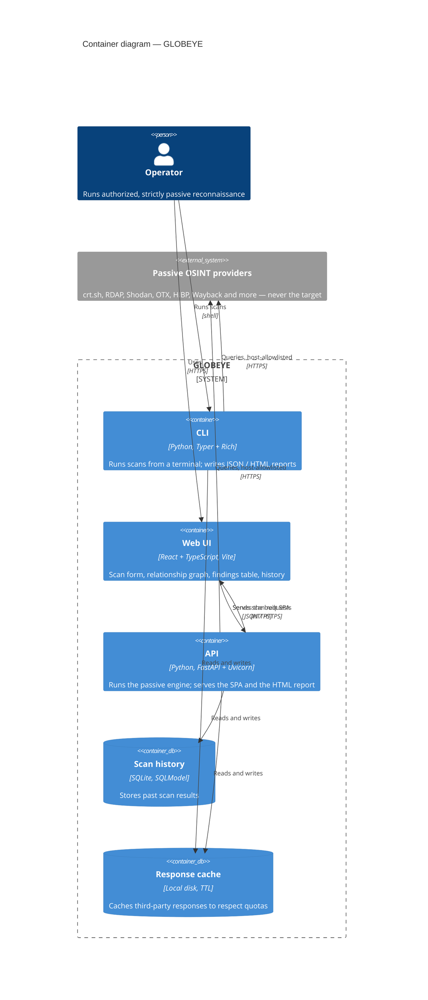
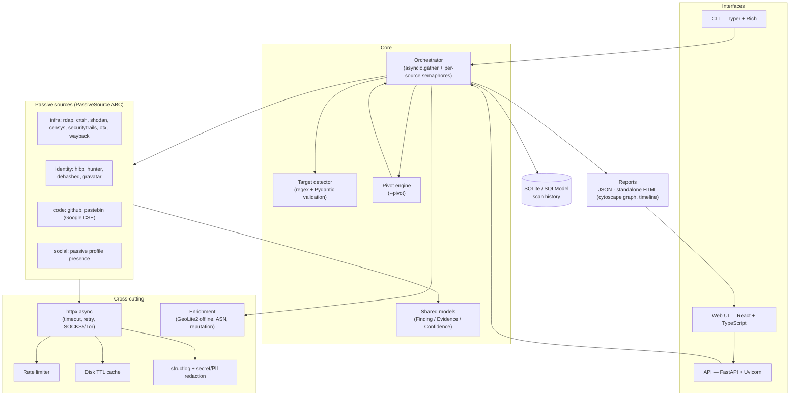

# Architecture

GLOBEYE is a passive OSINT collector. Input → target detection → concurrent
passive sources → dedup/pivot → persistence → reports (JSON / interactive
HTML). Nothing ever touches the target.

## Container diagram (C4)

The C4 *container* view — the high-level runnable pieces and the data they
exchange. "Container" here is the C4 sense (an independently runnable unit),
not a Docker container.

## Component diagram

## Request lifecycle

1. **Detect** — `core/target.py` classifies the input (domain, IP, ASN, CIDR,
   cert hash, email, username, phone, person, org).
2. **Select** — orchestrator picks sources whose `supported_target_types`
   match and whose required API key (if any) is present.
3. **Execute** — `asyncio.gather` with one `asyncio.Semaphore` per source for
   rate limiting; every call goes through cache → rate limiter → httpx.
4. **Normalize & dedup** — sources return `Finding`s; duplicates collapsed.
5. **Pivot** (optional) — new entities (e.g. a discovered email) enqueue
   follow-up passive scans.
6. **Persist & report** — store in SQLite, emit JSON + interactive HTML.

## Architecture decisions

Significant decisions are recorded as Architecture Decision Records in
[`adr/`](adr/):

- [0001 — Passive-only architecture](adr/0001-passive-only-architecture.md)
- [0002 — Source registry and self-registration](adr/0002-source-registry-self-registration.md)
- [0003 — uv and a standalone Python build](adr/0003-uv-and-python-build-standalone.md)

## Hard invariant

A test snapshots every outbound URL and asserts it belongs to the
**third-party allowlist** and never to the target host. This is what makes
GLOBEYE *provably* passive.
